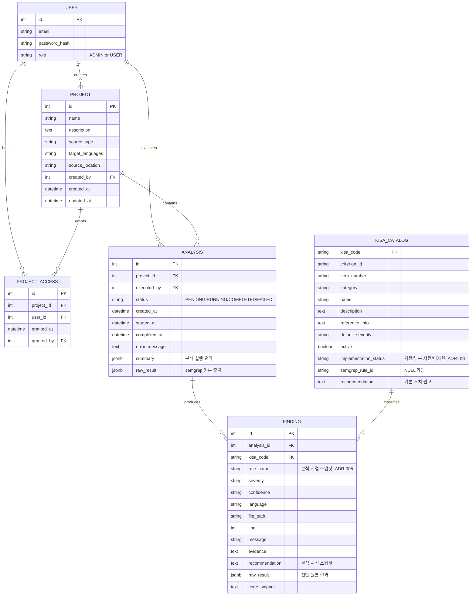

# SecScan ERD (MVP 기준)

이 ERD는 docs/mvp.md에 정의된 MVP 7개 기능만 반영합니다. MVP 제외 기능(대시보드 시각화, 이력 비교 등)의 엔티티는 포함하지 않았습니다.

`PROJECT_ACCESS(project_id, user_id)` UNIQUE 제약.

## MVP 기능 ↔ 엔티티 매핑

| MVP 기능 | 관련 엔티티 |
|---|---|
| 1. 인증/인가 | USER |
| 2. 프로젝트 관리 | PROJECT, PROJECT_ACCESS |
| 3. 코드 업로드 | PROJECT, ANALYSIS |
| 4. 정적 분석 실행 | ANALYSIS, KISA_CATALOG (ADR-003) |
| 5. 분석 상태 관리 | ANALYSIS.status, error_message |
| 6. 결과 조회 | FINDING (스냅샷 필드, ADR-005) |
| 7. 기본 보안 | USER.password_hash, PROJECT_ACCESS(권한 체크), ANALYSIS(경로 검증) |
