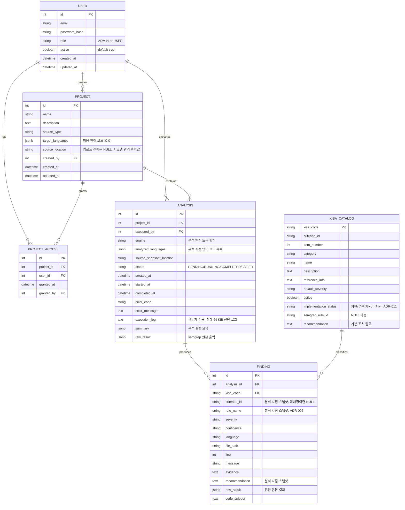

# SecScan ERD (MVP 기준)

이 ERD는 docs/mvp.md에 정의된 MVP 7개 기능만 반영합니다. MVP 제외 기능(대시보드 시각화, 이력 비교 등)의 엔티티는 포함하지 않았습니다.

`USER.active`가 `false`인 계정은 새 로그인을 할 수 없고, 이미 발급된 토큰으로 보호 API를 요청해도 인증에 실패한다. 계정 비활성화 처리의 상세 정책은 ADR-013을 따른다.

`PROJECT_ACCESS(project_id, user_id)` UNIQUE 제약.

`PROJECT_ACCESS`는 일반 사용자에게 부여한 프로젝트 접근권한을 저장한다. ADMIN은 별도 접근권한 행 없이 모든 프로젝트에 접근한다.

`PROJECT.target_languages`는 프로젝트에서 분석할 언어 코드의 목록이다. MVP 허용값은 `JAVA`, `JAVASCRIPT`, `PYTHON`이며 한 개 이상을 저장한다.

`PROJECT.source_location`은 프로젝트 생성 시 비어 있을 수 있다. 파일 업로드가 성공하면 시스템이 관리하는 업로드 위치값을 기록하며, 사용자가 서버 경로를 직접 입력하지 않는다.

`source_status`는 `PROJECT`에 저장하지 않는 API 응답용 계산값이다. 서버는 `source_location`이 비어 있으면 `NEEDS_UPLOAD`, 존재하면 `REGISTERED`를 반환한다. 내부 `source_location` 자체는 API 응답으로 제공하지 않는다.

`ANALYSIS.engine`은 해당 실행에 사용한 분석 엔진 또는 방식을 기록한다. `ANALYSIS.analyzed_languages`는 실행 생성 시점에 확정한 언어 코드 목록이며, 이후 `PROJECT.target_languages`가 바뀌어도 변경하지 않는다.

`ANALYSIS.source_snapshot_location`은 해당 분석이 사용할 `analyses/{analysis_id}/source` 시스템 관리 위치값이다. 분석 생성 시 경로값을 먼저 기록하고, `RUNNING` 백그라운드 작업이 업로드 검증이 끝난 `PROJECT.source_location`의 전체 사본을 이 위치에 만든다. 이후 프로젝트 소스가 교체되거나 수정되어도 기존 분석의 스냅샷 위치는 변경하지 않는다. 서버 재시작 등으로 실패한 분석은 이 위치가 비어 있거나 일부만 채워질 수 있으며 새 분석 행으로 재실행한다. MVP 기간에는 완료된 분석 스냅샷을 자동 삭제하지 않는다. 이 내부 위치값은 API 응답으로 제공하지 않는다. 관리자 소스 뷰어는 MVP 완료 조건에 포함되지 않는 선택 작업이며, 이후 구현하게 되면 분석 식별자를 기준으로 서버 안에서만 이 값을 사용한다.

`ANALYSIS.status`는 `PENDING`, `RUNNING`, `COMPLETED`, `FAILED` 중 하나다. `FAILED`의 세부 원인은 `error_code`에 저장하고, 상세 `error_message`와 최대 64 KiB의 `execution_log`는 ADMIN에게만 제공한다. 서버 내부 경로, 실행 명령, 환경변수, 업로드 원본 파일명은 어떤 역할의 응답에도 포함하지 않는다.

상태 전환은 `PENDING → RUNNING`, `PENDING → FAILED`, `RUNNING → COMPLETED`, `RUNNING → FAILED`만 허용한다. 완료 또는 실패한 분석을 다시 실행할 때는 기존 행을 변경하지 않고 새 분석 행을 만든다.

FINDING의 KISA 매핑 여부는 `kisa_code` 하나로 판단한다. 값이 있으면 KISA 매핑 결과이고, 값이 없으면 미매핑 결과다. API의 매핑 상태 필터값 `KISA_MAPPED`, `UNMAPPED`는 이 값에서 계산하며 별도 컬럼으로 저장하지 않는다. 미매핑 결과는 KISA 카탈로그 49개 항목에 추가하지 않는다.

FINDING의 `criterion_id`는 KISA 카탈로그의 기준 식별자를 결과 정규화 시점에 복사한 값이다. 카탈로그의 기준 식별자가 이후 수정되어도 과거 진단 결과의 기준 식별자는 변경하지 않는다. 미매핑 결과는 `criterion_id`를 비워 둔다.

## MVP 기능 ↔ 엔티티 매핑

| MVP 기능 | 관련 엔티티 |
|---|---|
| 1. 인증/인가 | USER |
| 2. 프로젝트 관리 | PROJECT, PROJECT_ACCESS |
| 3. 코드 업로드 | PROJECT, ANALYSIS |
| 4. 정적 분석 실행 | ANALYSIS, KISA_CATALOG (ADR-003) |
| 5. 분석 상태 관리 | ANALYSIS.status, error_message |
| 6. 결과 조회 | FINDING (스냅샷 필드, ADR-005) |
| 7. 기본 보안 | USER.password_hash, PROJECT_ACCESS(권한 체크), ANALYSIS(경로 검증) |
